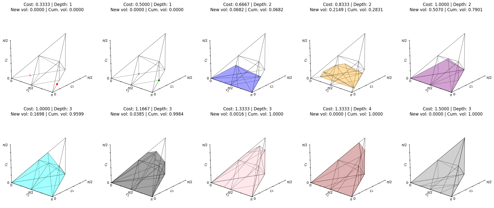
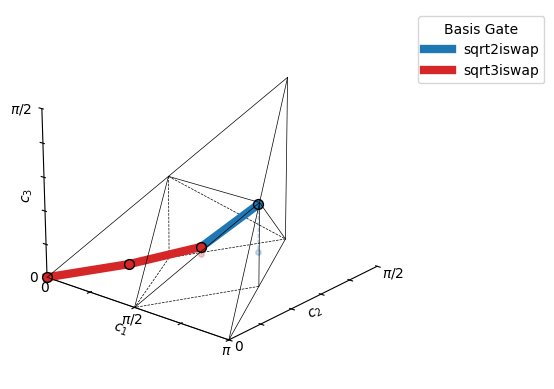
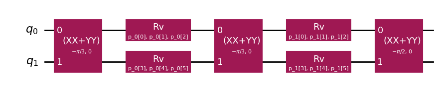
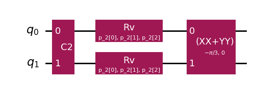
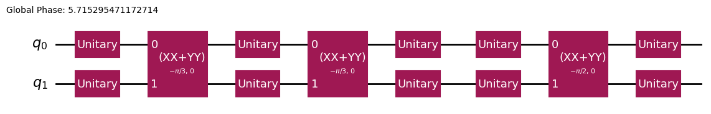

##  [GULPS](https://c.tenor.com/NAwgHzRfK_wAAAAC/tenor.gif)
 GULPS (Global Unitary Linear Programming Synthesis) is the first open tool that **robustly compiles arbitrary two-qubit unitaries optimally into non-standard instruction sets**.  

Most existing compilers only target CNOT gates. Analytical rules exist for a few special cases — fractional CNOT (XX family), Berkeley (B), and $\sqrt{\text{iSWAP}}$ — but nothing more general. Numerical methods can in principle handle arbitrary gates, but they are slow, unreliable, and do not scale as instruction sets grow.  **GULPS fills this gap** by combining linear programming with lightweight numerics to achieve:  
- Support for **fractional, continuous, or heterogeneous gate sets**.  
- **Scalability to larger ISAs**, unlike black-box numerical methods.  
- A fast, practical tool integrated with Qiskit if you study **gate compilation from two-body Hamiltonians** or parameterized unitary families.

#### 📌 Read the preprint: [Two-Qubit Gate Synthesis via Linear Programming for Heterogeneous Instruction Sets](https://arxiv.org/abs/2505.00543)

______
### 🖥️ Getting Started

- 🐍 `pip install gulps @ git+https://github.com/evmckinney9/gulps`
-  For usage examples, see: `src/gulps/notebooks/main.ipynb`.
-  Report issues: [Github issue tracker](https://github.com/ajavadia/hetero_isas/issues/4)

To begin, define your instruction set architecture (ISA) to configure the decomposer. Alternatively, if the instruction set is specified in the properties of a Qiskit `Target`, you can use GULPS as a `UnitarySynthesis` plugin.

In this example, we define an ISA as a list of Qiskit `Gate` objects, each with an associated cost and (optionally) a name. The name is only used in debugging logs. Costs are required to prioritize candidate circuit sentences and can be interpreted either as normalized durations or as fidelities. I typically use durations, where fractional gates incur a proportionally fractional cost relative to their basis gate, because currently the cost is taken to be additive.

```python
from qiskit.circuit.library import CXGate, iSwapGate
from gulps import GulpsDecomposer

isa = [
    (iSwapGate().power(1 / 2), 1 / 2, "sqrt2iswap"),
    (iSwapGate().power(1 / 3), 1 / 3, "sqrt3iswap"),
]
gate_set, costs, names = zip(*isa)
decomposer = GulpsDecomposer(gate_set=gate_set, costs=costs, names=names)
```

That's it—once initialized, you can call the decomposer with either a Qiskit `Gate` or a 4×4 `np.ndarray` representing a two-qubit unitary:
```python
from qiskit.quantum_info import random_unitary
from qiskit import QuantumCircuit

u = random_unitary(4, seed=0)
v: QuantumCircuit = decomposer(u)
v.draw()
```

Alternatively, to compile a full `QuantumCircuit`, use the GULPS `TransformationPass`. Because GULPS leaves single-qubit gates in each segment as generic `Unitary` gates, I recommend appending `Optimize1qGatesDecomposition` to rewrite them into standard gate sets:

```python
from gulps.qiskit_ext.synthesis_pass import GulpsDecompositionPass
from qiskit.transpiler import PassManager
from qiskit.transpiler.passes import Optimize1qGatesDecomposition
from qiskit.circuit.random import random_circuit

input_qc = random_circuit(4, 4, max_operands=2)
pm = PassManager(
    [
        GulpsDecompositionPass(decomposer),
        Optimize1qGatesDecomposition(basis="u3"),
    ]
)
output_qc = pm.run(input_qc)
output_qc.draw("mpl")
```
___
### 🔧 Overview of the Decomposition Process
The decomposition begins by identifying the cheapest feasible basis gate sentence—a sequence of native gates sufficient to construct the target unitary. We use [monodromy polytopes](https://github.com/qiskit-community/monodromy) to describe the reachable space of canonical invariants for each sentence in the ISA.

For example, this ISA:
```python
from gulps.core.isa import DiscreteISA

isa = DiscreteISA(
    gate_set=[iSwapGate().power(1 / 2), iSwapGate().power(1 / 3)],
    costs=[1 / 2, 1 / 3],
    names=["sqrt2iswap", "sqrt3iswap"],
    precompute_polytopes=True,
)
```
has the following coverage set:
```python
from gulps.core.coverage import coverage_report

coverage_report(isa.coverage_set)
```


Once a sentence is chosen, a linear program is used to determine a trajectory of intermediate invariants. These represent the cumulative two-qubit nonlocal action after each gate in the sentence—starting from the identity and ending at the target.
```python
from gulps.core.invariants import GateInvariants
from gulps.viz.invariant_viz import plot_decomposition

example_input = random_unitary(4, seed=31)
constraint_sol = decomposer._best_decomposition(
    target_inv=GateInvariants.from_unitary(example_input, enforce_alcove=True)
)
plot_decomposition(
    constraint_sol.intermediates, constraint_sol.sentence, decomposer.isa
);
```


In this example, the optimal sentence is composed of 2 $\sqrt[3]{\texttt{iSWAP}}$ gates and 1 $\sqrt[2]{\texttt{iSWAP}}$. 

#### (TODO: update the remaining part of the example)
That is, the resulting circuit falls into a parameterized ansatz like this:


The intermediate points break the problem into simpler subproblems, each corresponding to a depth-2 circuit segment. In this case, the circuit has three segments, although the blue segment is fixed (e.g., identity). That leaves two segments requiring synthesis:

|  |  |
|:------------------------:|:------------------------:|
| Orange              | Green                |

We solve for the local one-qubit gates in each segment using a numerical root-finding routine:
```python
example_segment_solutions = decomposer._local_synthesis._synthesize_segments(
    example_sentence, example_intermediates
)
print("Segment solutions:", example_segment_solutions)
Segment solutions:
[array([ 3.04980046, -3.97898785, -5.08187288,  5.42993702,  4.16191883,0.7034179 ]),
array([-2.49813347, -4.0929992 ,  0.14047136,  2.82952009,  4.63593378, 0.32678556])]
```
After solving the individual segments, we apply a final stitching step to handle orietation between segments and to promote local equivalence into global unitary equivalence:
```python
# Recover unitary equivalence by promoting local equivalence
ret = decomposer._local_synthesis._stitch_segments(
    example_sentence, example_intermediates, example_segment_solutions
)
U, V = c1c2c3(example_input), c1c2c3(Operator(ret).data)
print("Input unitary weyl invariants:", U)
print("Output unitary weyl invariants:", V)
ret.draw()
Input unitary weyl invariants: (np.float64(0.44173763), np.float64(0.34153949), np.float64(0.15117788))
Output unitary weyl invariants: (np.float64(0.44173763), np.float64(0.34153949), np.float64(0.15117788))
```


___
See more:
 - https://threeplusone.com/pubs/on_gates.pdf
 - https://chromotopy.org/latex/papers/xx-synthesis.pdf
 - https://github.com/qiskit-advocate/qamp-spring-23/issues/33
 - https://github.com/Qiskit/qiskit/pull/9375
 - https://weylchamber.readthedocs.io/en/latest/readme.html
