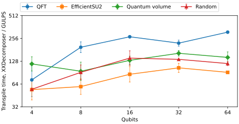

.. meta::
   :description: Output duration of GULPS against Qiskit's default synthesis, and transpile time against Qiskit's XXDecomposer, for fixed-angle RZZ gates.

Transpilation benchmarks
========================

.. note::

   Qiskit has no synthesis method that does what GULPS does, so neither
   comparison is like for like. The default synthesis uses one kind of
   entangling gate per block, which is not optimal when the Target offers several.
   XXDecomposer finds least-cost sequences for these gates, but it runs in
   Python and has not been ported to Rust.

These benchmarks transpile QFT, EfficientSU2, quantum-volume, and random
circuits of 4 to 64 qubits for an all-to-all Target with ``U`` and
:math:`R_{ZZ}(\pi/2)`, :math:`R_{ZZ}(\pi/4)`, and :math:`R_{ZZ}(\pi/6)`.
Duration is the sum of the gate durations, without scheduling.

Against Qiskit's default synthesis
----------------------------------

Qiskit's default synthesis produces circuits 1.5 to 2 times longer than GULPS
on every circuit except EfficientSU2. It synthesizes each block with
:class:`~qiskit.synthesis.TwoQubitBasisDecomposer` over
:math:`R_{ZZ}(\pi/2)` alone, which is locally equivalent to CX, while
GULPS also uses the two shorter gates.

.. jupyter-execute::

   import json
   from pathlib import Path

   rows = json.loads(Path("docs/_scripts/fullcircuit.json").read_text())
   qubits = sorted({r["qubits"] for r in rows})
   families = list(dict.fromkeys(r["circuit"] for r in rows))
   ratio = {
       (r["circuit"], r["qubits"]): r["qiskit_duration_us"] / r["gulps_duration_us"]
       for r in rows
   }
   print("Default / GULPS summed duration")
   print(f"{'Circuit':<14}" + "".join(f"{f'{n} qubits':>11}" for n in qubits))
   for family in families:
       print(f"{family:<14}" + "".join(f"{ratio[family, n]:>11.2f}" for n in qubits))

EfficientSU2 entangles with CX, so both outputs use
:math:`R_{ZZ}(\pi/2)` only.

Against XXDecomposer
--------------------

GULPS transpiles tens to hundreds of times faster than XXDecomposer, with
the same summed two-qubit duration in 19 of the 20 cases. To make the two
minimize the same cost, each :math:`R_{ZZ}` gate gets the fidelity
``(1 - ERR_BASE) ** p``, where ``p`` is its duration relative to
:math:`R_{ZZ}(\pi/2)`, so XXDecomposer's largest fidelity product is the
least summed duration.

   XXDecomposer's transpile time divided by GULPS's. Each point is the
   geometric mean of two rounds, and the bars span both rounds.

.. details:: The one case with different duration

   In the random circuit at 64 qubits, XXDecomposer's output is shorter by
   one sixth of the :math:`R_{ZZ}(\pi/2)` duration. The difference comes
   from one block with Weyl coordinates :math:`(11/24,11/24,0)`.
   XXDecomposer synthesizes this block with one :math:`R_{ZZ}(\pi/6)` and
   three :math:`R_{ZZ}(\pi/4)`, whose interaction strengths sum to
   :math:`11/12`, the sum of the block's coordinates. The block therefore
   lies on the boundary of the region of this cheaper sentence. XXDecomposer's
   reachability tolerance accepts the block, and its output has process
   infidelity up to :math:`9.5\times10^{-13}` against it. GULPS uses two
   :math:`R_{ZZ}(\pi/2)` gates.

Measurement setup
-----------------

All pipelines ran with Qiskit 2.5.2 and GULPS built from this repository,
pinned to one core of an AMD Ryzen 5 5600X under WSL2. BLAS, OpenMP, and
Rayon each used one thread. Each measurement has two rounds with fresh
decomposers and pass managers, and the pipeline order changes between
rounds.

.. literalinclude:: _scripts/fullcircuit.py
   :language: python
   :start-at: GATES = [
   :end-before: class XXPass

.. literalinclude:: _scripts/fullcircuit.py
   :language: python
   :pyobject: XXPass

.. literalinclude:: _scripts/fullcircuit.py
   :language: python
   :pyobject: pass_managers

Each pipeline runs once on a small circuit before it is timed.

.. literalinclude:: _scripts/fullcircuit.py
   :language: python
   :pyobject: benchmark

.. details:: Plotting code

   .. literalinclude:: _scripts/fullcircuit.py
      :language: python
      :pyobject: plot

Reproduce the measurements
--------------------------

``docs/_scripts/fullcircuit.py`` writes ``docs/_scripts/fullcircuit.json``
and the figure; ``--plot`` redraws the figure from the JSON file. Pinned to
one core:

.. code-block:: bash

   taskset -c 2 python docs/_scripts/fullcircuit.py

The run takes about three minutes, most of it in XXDecomposer at 32 and 64
qubits.
